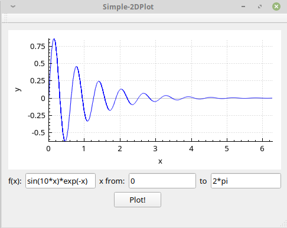

本程序依赖项目：
1. https://github.com/codeplea/tinyexpr，这是一个小巧灵活的数学公式解析工具，适合轻量级的数学表达式求值等需求；
2. https://www.qcustomplot.com ，这是一个基于Qt5的轻量绘图库，相比于Qwtplot，QCustomPlot使用更加方便简单

本程序功能：
通过QLineEdit控件输入自定义函数，结合QCustomPlot绘制二维函数（即一元函数：y=f(x)）图

效果图如下：

## 关键点
- （1）将QString转换为const char类型
- （2）tinyexpr解析数学公式表达式用到的几个关键函数：`te_interp`,`te_eval`