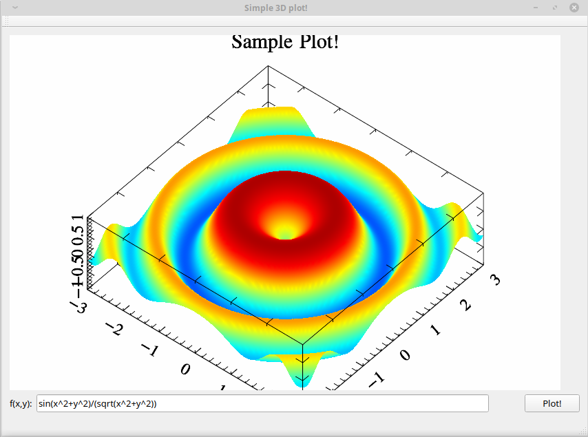
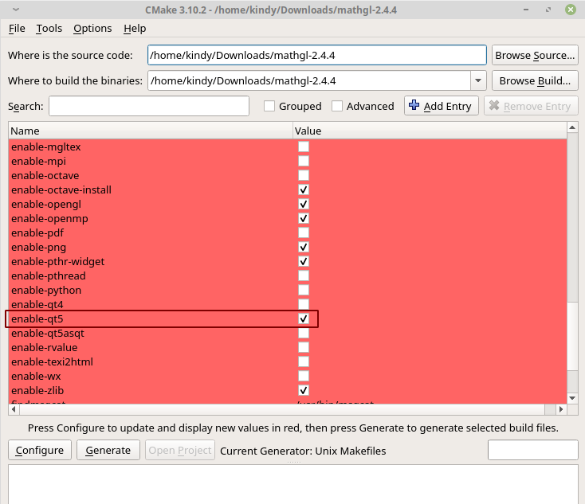

本程序依赖项目：
1. http://mathgl.sourceforge.net/ ，这是一个轻量级的数学函数绘图软件，提供了多种编程语言接口（Python/C/C++/Octave/Fortran），已及支持多种图形平台，如FLTK,Qt,wxWidget等

本程序功能：
通过QLineEdit控件输入自定义函数，结合QCustomPlot绘制三维函数（即二元函数：z=f(x,y)）

效果图如下：

## 安装
首先需要官网下载源码编译，笔者是在Linux环境使用的，编译安装都比较简单，常规的编译安装过程，没有报错。**注意:cmake配置需要勾选qt5选项**：

编译完成后会生成mgl相关的链接库

## 配置
修改.pro文件，添加以下代码到`.pro`文件：

`LIBS += -lmgl-qt5 -lmgl`
